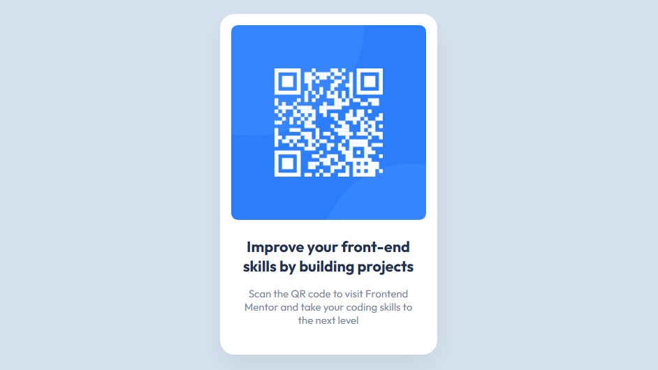

# Frontend Mentor - QR code component solution

This is a solution to the [QR code component challenge on Frontend Mentor](https://www.frontendmentor.io/challenges/qr-code-component-iux_sIO_H). Frontend Mentor challenges help you improve your coding skills by building realistic projects.

###### The structure of this documentation has been retained for future reference.

## Table of contents

-   [Overview](#overview)
    -   [Screenshot](#screenshot)
    -   [Links](#links)
-   [My process](#my-process)
    -   [Built with](#built-with)
    -   [What I learned](#what-i-learned)
    -   [Continued development](#continued-development)
    -   [Useful resources](#useful-resources)
-   [Author](#author)
-   [Acknowledgments](#acknowledgments)

## Overview

### Screenshot



### Links

-   [Live Site URL](https://bernardovazm.github.io/qr-code-component/)

## My process

### Built with

-   Semantic HTML5 markup
-   CSS custom properties
-   Descendent selector
-   CSS Grid
-   Mobile-first workflow

### What I learned

###### Containing comments, tips and reminders cleaned out from the code

Name mangling convention example:

```html
<article class="card">
	...
	<div class="card__description"></div>
</article>
```

#### CSS reset

Sizing made simpler:

```css
*,
*::before,
*::after {
	box-sizing: border-box;
}
```

Remove default spacing
Force styling of type through styling, rather than elements:

```css
* {
	margin: 0;
	padding: 0;
	font: inherit;
}
```

Dark mode user-agent-styles:

```css
html {
	color-scheme: dark light;
}
```

Minimum body height:

```css
body {
	min-height: 100vh;
}
```

Responsive images/videos:

```css
img,
picture,
svg,
video {
	display: block;
	max-width: 100%;
}
```

💡 Tip for importing fonts: &lt;link&gt; performs better than @import. Check [stevesouders](https://www.stevesouders.com/blog/2009/04/09/dont-use-import/) post to read more about it.

### Continued development

There are many areas I wish to improve, from SEO, accessibility, better and more concise CSS, and even writing better git commit messages. Some ideas of what could be improved for this project:

-   [ ] Use a pre-processor, such as Sass;
-   [ ] SEO;
-   [ ] Implement Dark Theme;

### Useful resources

-   [NekoCalc](https://nekocalc.com/) - Many online useful calculators.
-   [NekoColor](https://nekocolor.com/) - Easily shareable color picker by just copying the URL.
-   [Box-shadow examples - CSS Scan](https://getcssscan.com/css-box-shadow-examples) - Simple, very visual and straightforward box-shadows examples that I used in this project.

## Author

-   Github - [Bernardo Vaz](https://github.com/bernardovazm)
-   Frontend Mentor - [@bernardovazm](https://www.frontendmentor.io/profile/bernardovazm)

## Acknowledgments

I don't have direct acknowledgments for this project, but some free high quality learning and helping material I would care to recommend are [freeCodeCamp](https://www.freecodecamp.org/news) amazing courses and [this programming library](https://biblioteca.rocketseat.com.br/) in portuguese by Rocketseat (formerly discover "conectar", "fundamentar" and "especializar" courses, containing more than 40 hours of content).
